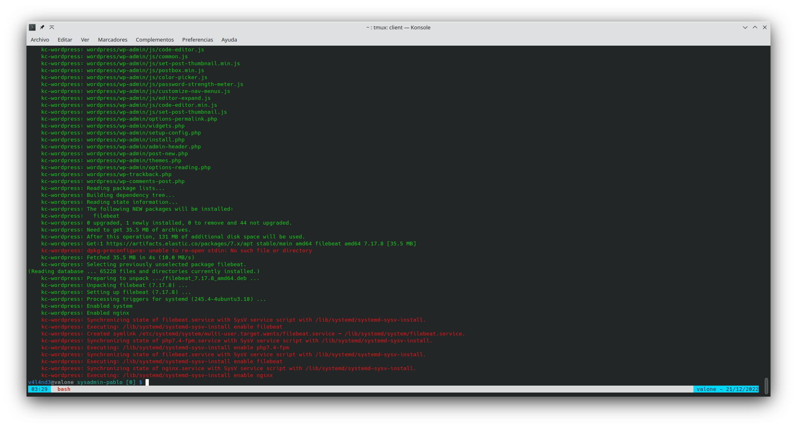
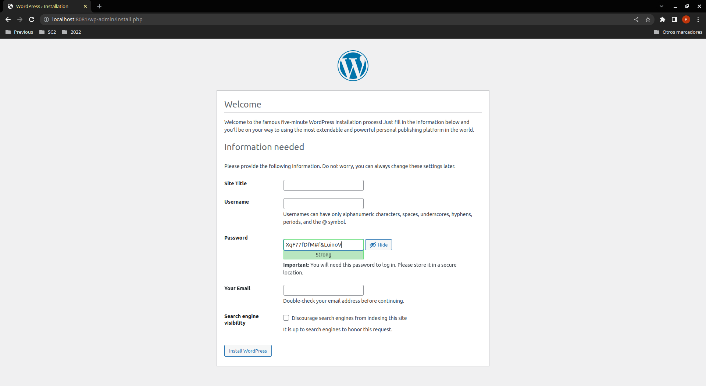
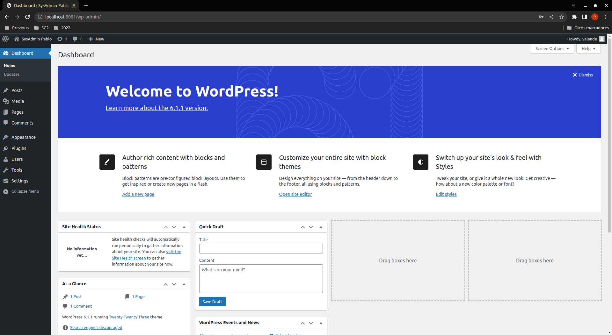
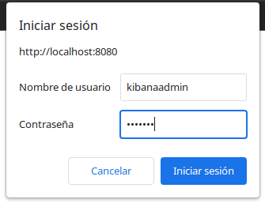
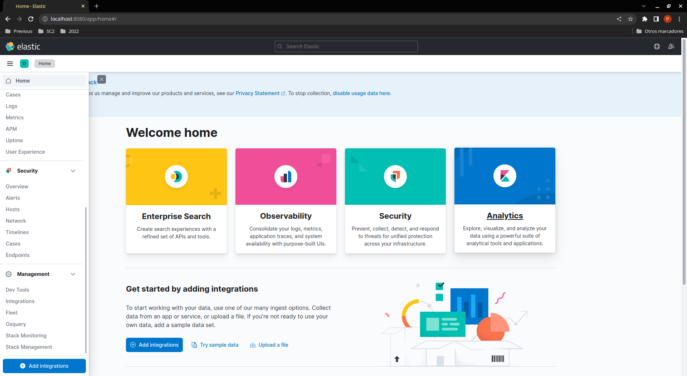
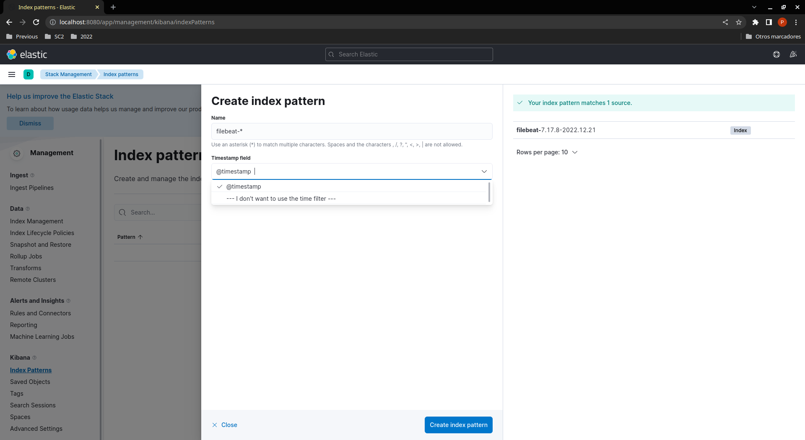
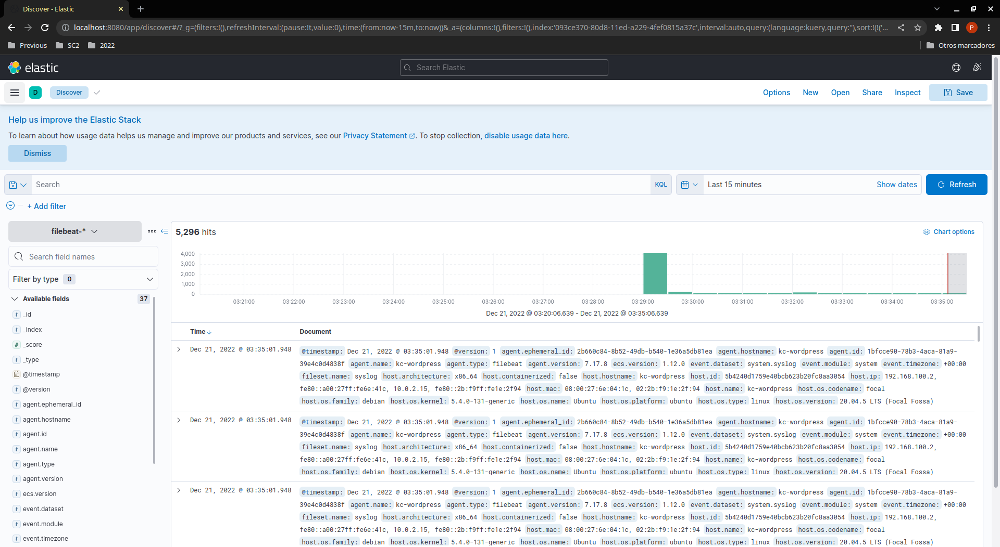
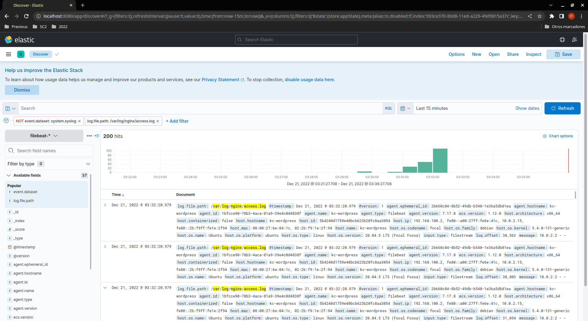
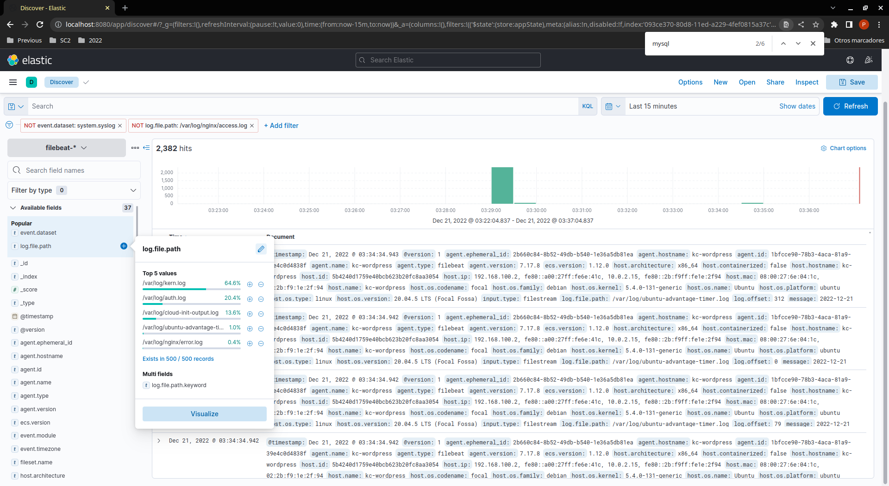

# sysadmin-pablo

## Práctica SysAdmin Pablo Cazallas González
### Despliegue de stacks ELK y Wordpress con Vagrant y VirtualBox

- Sistema:

    - Mínimo 4 Gb de memoria ram (8 Gb recomendado).
    - Mínimo 4 Gb disponibles de espacio en disco.
    - Vagrant (versión 2.3.4)
    - VirtualBox (versión 6.1)
    - Terminal de línea de comandos.
    - Navegador web.

- Infraestructura:

    1. Clonar el repositorio git.
    2. Modificar el fichero *.kibana*, indicando la contraseña a utilizar para identificarse en Kibana.
    3. Invocar el comando <code>vagrant up</code> y esperar a que termine de ejecutar todos sus pasos.
    

- Wordpress:

    1. Abrir la url <code>http://localhost:8081</code> en el navegador.
    2. Seguir el asistente de configuración que se muestra.
    
    3. Tras hacer login se mostrará el Dashboard.
    

- Monitorización con Kibana:

    1. Abrir la url <code>http://localhost:8080</code> en el navegador.
    2. Identificarse con el usuario <code>kibanaadmin</code> y la contraseña indicada previamente en el fichero *.kibana*.
    
    3. Desde <code>Management-Stack Management-Index Patterns</code>, crear un <code>index-pattern</code> de nombre <code>filebeat-*</code> y seleccionar <code>timestamp</code> como campo de referencia de tiempo.
    
    
    4. Desde la opción de menú <code>Discover</code> se pueden consultar los logs una vez realizado el paso previo.
    
    
    
    